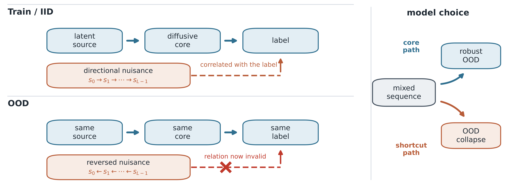

# A Cue-Locality Audit Framework for Attributing Spurious Temporal Shortcuts in Deep Sequence Models

YoungJae Cho, Do-Yup Kim, Youngjun Kim, Dae-Yeol Kim

[Code](https://github.com/GongJae00/spurious-arrow-of-time)

<p align="center">
  
</p>

<p align="center"><em>Figure 1.</em> Both cues predict the label at train/IID. OOD changes only the nuisance–label relation: a core-following model stays robust, a shortcut-following model collapses.</p>

## Overview

IID accuracy does not identify which temporal cue a sequence model uses. A directional cue can be generated by a temporal process and still be readable from a single frame; an OOD score cannot tell that apart from genuine order dependence. This paper is a six-gate cue-locality audit for controlled, factor-intervenable temporal benchmarks, with a companion generator that makes every gate independently testable.

## Main results

On **OE-Strict**, whose direction is readable only from interior frame order, CNN+GRU sequence ERM selects the shortcut in 30/30 seeds (0.970 IID, 0.030 OOD). Channel-selective interventions attribute the collapse to nuisance frame ordering (Table 5).

The same audit reclassifies the **trail** variant, designed as an order cue, as **frame-local**: a single intermediate frame decodes the direction at 1.000, and the cue survives shuffling (Table 6, Figure 4).

On the trail mixed task, sequence ERM collapses in 29/30 seeds (Table 7: 0.971 IID, 0.061 OOD).

Logged numbers are under `results/extended/`.

## Code

This repository is the generator, the sequence models, the audit scripts, and the logged runs behind the manuscript tables.

| Path | Role |
|---|---|
| `src/data/irreversible_source_inference.py` | Core/nuisance generator (trail and simple order-encoded) |
| `src/eval/hardpair_oe.py` | OE-Strict nuisance (Table 5) |
| `src/eval/midclass_oe.py` | Set-MF nuisance |
| `src/models/minimal_sequence.py` | CNN+GRU and architecture variants |
| `src/train/main_experiment.py` | YAML-profile training |
| `configs/irreversible_source_extended.yaml` | Paper profiles (`main_canonical`, `oe_canonical`, sweeps) |
| `src/eval/` | Cue-locality probes, transfer, appendix runs |
| `src/visualization/` | Manuscript figures |
| `results/extended/` | Logged artifacts |
| `figures/` | Figures 1–4 and A1–A3 |

```bash
pip install -e ".[dev]"
```

YAML-profile runs:

```bash
python -m src.train.main_experiment \
  --config configs/irreversible_source_extended.yaml \
  --profile <profile> \
  --out results/extended/<profile>
```

## Reproduction

Main text:

| Paper | Command | Output |
|---|---|---|
| Table 5 OE-Strict | `python -m src.eval.hardpair_oe --seeds 30` | `results/extended/hardpair_oe30.json` |
| Table 5 certification | `python -m src.eval.hardpair_certify --seeds 5` | `results/extended/hardpair_certify.json` |
| Table 5 shuffle | `python -m src.eval.hardpair_shuffle --seeds 5` | `results/extended/hardpair_shuffle.json` |
| Table 5 no-spurious | `python -m src.eval.hardpair_oe --seeds 10 --nospurious --out results/extended/hardpair_nospur.json` | `results/extended/hardpair_nospur.json` |
| Table 6, Figure 4 trail | `python -m src.eval.temporal_evidence_audit --seeds 10` | `results/extended/temporal_evidence_audit.json` |
| Table 6, Figure 4 simple OE | `python -m src.eval.temporal_evidence_audit --seeds 10 --trail-decay 0.0 --out results/extended/temporal_evidence_audit_oe.json` | `results/extended/temporal_evidence_audit_oe.json` |
| Table 6 probes | `python -m src.eval.strict_order_audit --seeds 10` | `results/extended/strict_order_audit.json` |
| Figure 4b nuisance-only | `python -m src.eval.nuisance_order_probe --seeds 10` | `results/extended/nuisance_order_probe.json` |
| Table 7, A15, A16 trail 30-seed | `--profile main_canonical` | `results/extended/main_canonical/` |
| Table 8 MF-Core | `--profile hardcore_oe` | `results/extended/hardcore_oe/` |
| Table 8 core probes | `python -m src.eval.hardcore_probe_final --seeds 5`; `python -m src.eval.hardcore_perframe --seeds 5` | `results/extended/hardcore_probe_final.json`, `hardcore_perframe.json` |
| Set-MF | `python -m src.eval.midclass_oe --seeds 10` | `results/extended/midclass_oe.json` |
| Table 9 FordA | `python -m src.eval.semisynthetic_ucr --official --dataset forda --out results/extended/semisyn_official_forda.json` | `results/extended/semisyn_official_forda.json` |
| Table 9 HAR | `python -m src.eval.semisynthetic_ucr --official --dataset har --out results/extended/semisyn_official_har.json` | `results/extended/semisyn_official_har.json` |
| Table 9 HAR-2 | `python -m src.eval.semisynthetic_ucr --official --dataset har2 --out results/extended/semisyn_official_har2.json` | `results/extended/semisyn_official_har2.json` |
| Figure 1 | `python -m src.visualization.submission_figures` | `figures/fig1_conceptual_problem.png` |
| Figure 2 | `python -m src.visualization.audit_flow_figure` | `figures/fig2_audit_flow.png` |
| Figure 3 | `python -m src.visualization.paper_figures` | `figures/fig3_benchmark_construction.png` |
| Figure 4 | `python -m src.visualization.temporal_audit_figure` | `figures/fig4a_perframe_probes.png`, `fig4b_order_interventions.png` |

Appendix (manuscript Table A21):

| Paper | Run | Output |
|---|---|---|
| Figure A1, Table A8 family | `--profile family` | `results/extended/family/`; `figures/fig5_benchmark_family.png` |
| Figure A2, Table A9 complexity | `--profile complexity` / `complexity_controls` | `results/extended/complexity/`, `complexity_controls/`; `figures/fig6_complexity_scaleup.png` |
| Figure A3 scenario | `--profile scenario_audit` | `results/extended/scenario_audit/`; `figures/fig7_scenario_audit.png` |
| Table A2 / A3 correlation | `--profile oe_corr_sweep` / `corr_sweep` | `results/extended/oe_corr_sweep/`, `corr_sweep/` |
| Table A4 / A5 architectures | `--profile oe_model_family` / `model_family` | `results/extended/oe_model_family/`, `model_family/` |
| Table A6 methods | `python -m src.eval.unified_paired_bench` | `results/extended/unified_paired.json` |
| Table A10 sinusoid | `python -m src.eval.freqsweep_oe --seeds 10` | `results/extended/freqsweep_oe.json` |
| Table A11 graphs | `python -m src.eval.graph_source_experiment --graph karate` (or `lesmis`) | `results/extended/graph_source/` |
| Table A12 video | `--profile real_video_4k` / `real_video_blur_8k` | `results/extended/real_video_4k/`, `real_video_blur_8k/` |
| Table A13 simple OE 30-seed | `--profile oe_canonical` | `results/extended/oe_canonical/` |
| Table A17 budget | `--profile ext_budget_main` / `oe_ext_budget` | `results/extended/ext_budget_main/`, `oe_ext_budget/` |
| Table A18 multi-init | `python -m src.eval.multi_init_experiment` | `results/extended/multi_init.json` |
| Table A1 accessibility | `python -m src.eval.cue_accessibility` | `results/extended/cue_accessibility.json` |
| Table A19 mixing | `--profile channel_mixing` / `oe_channel_mixing` | `results/extended/channel_mixing/`, `oe_channel_mixing/` |
| Nuisance amplitude | `--profile nuisance_scale_sweep` / `oe_scale_sweep` | `results/extended/nuisance_scale_sweep/`, `oe_scale_sweep/` |
| OE-Core | `--profile occ_benchmark` | `results/extended/occ_benchmark/` |
| OE-Core equalized / order-rand | `python -m src.eval.occ_equalized --seeds 10`; `python -m src.eval.occ_and_paired --seeds 10` | `results/extended/occ_equalized.json`, `occ_and_paired.json` |
| Architecture single-cue | `python -m src.eval.arch_cue_control --seeds 5` | `results/extended/arch_cue_control.json` |
| GroupDRO sensitivity | `python -m src.eval.groupdro_sensitivity --seeds 10` | `results/extended/groupdro_sensitivity.json` |
| Endpoint direction probe | `python -m src.eval.endpoint_direction_audit` | `results/extended/endpoint_direction_audit.json` |
| Input-gradient saliency | `python -m src.eval.gradsal_compare --seeds 3` | `results/extended/gradsal_compare.json` |
| Real-video positive search | `python -m src.eval.rv_positive_search` | `results/extended/rv_positive_search.json` |

## Citation

```bibtex
@unpublished{Cho2026CueLocality,
  title={A Cue-Locality Audit Framework for Attributing Spurious Temporal Shortcuts in Deep Sequence Models},
  author={Cho, YoungJae and Kim, Do-Yup and Kim, Youngjun and Kim, Dae-Yeol},
  year={2026},
  url={https://github.com/GongJae00/spurious-arrow-of-time}
}
```
