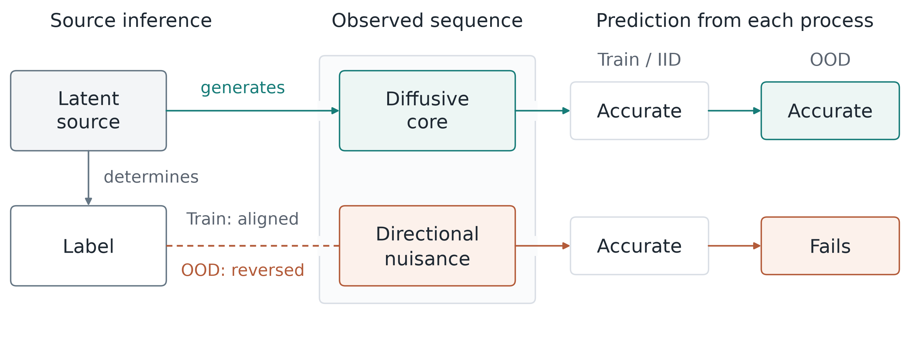

# A Cue-Locality Audit Framework for Attributing Spurious Temporal Shortcuts in Deep Sequence Models

YoungJae Cho, Do-Yup Kim, Youngjun Kim, Dae-Yeol Kim

Code, configurations, result records, and the original video cache are archived on [Zenodo](https://doi.org/10.5281/zenodo.23004570). The source archive corresponds to release `v0.1.1`.

<p align="center">
  
</p>

<p align="center"><em>Figure 1.</em> Both cues predict the label at train/IID. OOD changes only the nuisance–label relation: a core-following model stays accurate, while a shortcut-following model collapses.</p>

## Overview

IID accuracy does not identify which temporal cue a sequence model uses. A directional nuisance can be generated by a temporal process and still be readable from a single frame; an OOD score cannot locate that cue on the locality spectrum (frame-local, order-invariant multi-frame, or order-encoded).

Algorithm 2 builds one sample: a diffusive core from the label-determining source, a directional nuisance whose alignment P(ds|y) is 0.97 at train/IID and 0.03 at OOD, and the two-channel observation. Table 3 names the constructions: OE-Strict, FL-Trail, MF-Set, MF-Core, OE-Core.

Algorithm 1 is a six-gate audit on that generator. Phase 1 (Gates 1–5) asks whether an OOD collapse can be read as a shortcut: core accessible, nuisance predictive, endpoint controlled, core recoverable, reversal attribution. Gate 5 reverses P(ds|y). Phase 2 (Gate 6) locates the cue with single-frame probes, order-invariant summaries, an unordered-set probe, and order interventions (shuffle, reverse).

## Main results

On **OE-Strict**, whose direction is readable only from interior frame order, CNN+GRU sequence ERM selects the shortcut in 30/30 seeds (0.970 IID, 0.030 OOD). Channel-selective interventions attribute the collapse to nuisance frame ordering (Table 5).

The same audit reclassifies the **trail** variant, designed as an order cue, as **frame-local**: a single intermediate frame decodes the direction at 1.000, and the cue survives shuffling (Table 6, Figure 4).

On the trail mixed task, sequence ERM collapses in 29/30 seeds (Table 7: 0.971 IID, 0.061 OOD).

Logged numbers are under `results/main/`, `results/ablation/`, and `results/reviewer/`. [Reproduction checks](results/reviewer/reproduction.json) compare 80 MF-Core runs and 40 counterfactual runs with the archived results, including per-seed differences.

## Code

`generate_split` in `src/data.py` is Algorithm 2: y, core (Eq. 6), ds (Eq. 4), nuisance (Eqs. 7–8), observation (Eq. 9). `make` in `src/benchmark.py` is Table 3: OE-Strict, FL-Trail, MF-Set, MF-Core, OE-Core. FordA, HAR, and the graph loaders are the Table 9 and Table A11 inputs in the same file.

`SequenceCNNGRU` in `src/models.py` is the main sequence model. Eq. 10 is the predictor, Eq. 11 is ERM, and Eq. 12 is the counterfactual loss: supervised cross-entropy on both inputs plus `0.2 * KL(stopgrad[p(x)] || p(x_cf))`. LSTM, TCN, Transformer, and temporal pooling are Tables A4–A5. `SegGRU` is Table 9. `train_sequence` in `src/train.py` is the reference learner (Table A20). `train_one_method` is Table 7. `train_robust`, `train_dual`, and `train_irm` are Table A6.

For older locally saved checkpoints, rename `enc.*` to `frame_encoder.*` in `SetProbe` or `segment_encoder.*` in `SegGRU`, `net.*` to `feature_encoder.*` in `FinalFrameMLP`, and `pos_embedding` to `position_embedding` in `SequenceCNNTransformer`. Parameter shapes and order are unchanged.

`src/audit.py` collects factor-level measurements, probes, and order interventions for Algorithm 1. `Audit.run()` returns these measurements and a locality screening label. Apply the joint criteria in Table 2 to establish attribution. `regime` in `src/evaluate.py` labels accuracy outcomes using the 0.8 / 0.2 cuts; it does not certify a shortcut.

`src/experiments.py` runs the tables. The `kind` field in `configs/experiments.yaml` selects the function: `shortcut`, `certify`, and `shuffle` are Table 5; `temporal`, `strict_order`, and `nuisance_order` are Table 6 and Figure 4; `train` is Table 7; `mf_core_probes` and `mf_core_perframe` are Table 8; `ucr` is Table 9. The other kinds are the appendix tables.

```bash
pip install -e ".[dev,transfer]"
python -m src.experiments
```

`python -m src.experiments --run table5_oe_strict` runs one key in `configs/experiments.yaml`. The full runner skips existing outputs. For a fresh run, copy `configs/` to a local directory, change the selected experiment's `out` path, and pass that directory with `--configs`. Keep the archived results for comparison. Run `python -m pytest -q` to check the generator and model invariants.

## External data

Synthetic inputs are generated from the configurations and seeds. External inputs are downloaded separately:

- **FordA:** place the official [UCR FordA](https://www.timeseriesclassification.com/description.php?dataset=FordA) train/test TSV files at `data/ucr/FordA_TRAIN.tsv` and `data/ucr/FordA_TEST.tsv`.
- **HAR:** extract the [UCI smartphone activity dataset](https://archive.ics.uci.edu/dataset/240/human+activity+recognition+using+smartphones) under `data/ucr/har/`, retaining the `UCI HAR Dataset` directory and its official train/test split.
- **Graphs:** NetworkX provides the Karate Club and Les Misérables graphs used by `graph_setup`.
- **Video:** [urls.json](data/real_video/urls.json) lists the Wikimedia sources. Download entries 0–6 as `clip00.webm`–`clip06.webm` in `data/real_video/`; these are the clips recorded in the [cache metadata](data/real_video/cache_g16_L8_s5.json). The eighth URL is not part of the reported cache. Source credits are listed below.

For the reported video experiments, download [the original cache](https://zenodo.org/records/23004570/files/cache_g16_L8_s5.npz?download=1) to `data/real_video/cache_g16_L8_s5.npz`. It contains 15,263 crops. Regenerating it from the same clips and recorded settings in the checked environment produced 15,261 crops; the cause is unresolved. The [comparison record](results/reviewer/reproduction.json) includes hashes, settings, and per-clip counts.

To regenerate the cache:

```bash
python -m src.data --out data/real_video/cache_regenerated.npz --t-stride 5 --min-motion 6 --short-side 48 --per-clip 3000 --seed 1234
```

The cache contains eight-frame sequences of 16 × 16 grayscale crops, normalized to uint8. The adapted video material is distributed under [CC BY-SA 4.0](https://creativecommons.org/licenses/by-sa/4.0/), with the source credits below. This license applies to the video cache, not the code. Raw videos are not redistributed.

<details>
<summary>Video source credits</summary>

| Source | Creator | Source license |
|---|---|---|
| [Tirana traffic lights](https://commons.wikimedia.org/wiki/File:Tirana_traffic_lights.webm) | Lan G. (Lan Glad / Upwinxp) | [CC BY 4.0](https://creativecommons.org/licenses/by/4.0/) |
| [Behind Kawaida Waterfall](https://commons.wikimedia.org/wiki/File:Video_from_behind_Kawaida_Waterfall_through_hanging_roots,_Kiambu_County.webm) | Lebu Ayiga | [CC BY 4.0](https://creativecommons.org/licenses/by/4.0/) |
| [Side view of Kawaida Waterfall](https://commons.wikimedia.org/wiki/File:Side_view_video_of_Kawaida_Waterfall_cascading,_Cianda,_Kiambu_County.webm) | Lebu Ayiga | [CC BY 4.0](https://creativecommons.org/licenses/by/4.0/) |
| [Park Fire](https://commons.wikimedia.org/wiki/File:Smoke_Rises_From_Burning_Flames_of_the_Park_Fire_%28CIRA_2024-07-25_-_nolabels%29.webm) | NOAA / CIRA | Public domain |
| [Gazan buildings](https://commons.wikimedia.org/wiki/File:Tasnim_News_Agency_-_Footage_from_Israeli_airstrikes_levelling_Gazan_buildings.webm) | Tasnim News Agency | [CC BY 4.0](https://creativecommons.org/licenses/by/4.0/) |
| [Chandra River](https://commons.wikimedia.org/wiki/File:Chandra_river_flowing_in_Sissu_Valley.webm) | Simrank0599 | [CC BY-SA 4.0](https://creativecommons.org/licenses/by-sa/4.0/) |

The Kyiv clip contributed no accepted crops.

</details>

## License

The code is licensed under the [MIT License](LICENSE). The video cache is licensed separately under [CC BY-SA 4.0](https://creativecommons.org/licenses/by-sa/4.0/), with source credits listed above.
